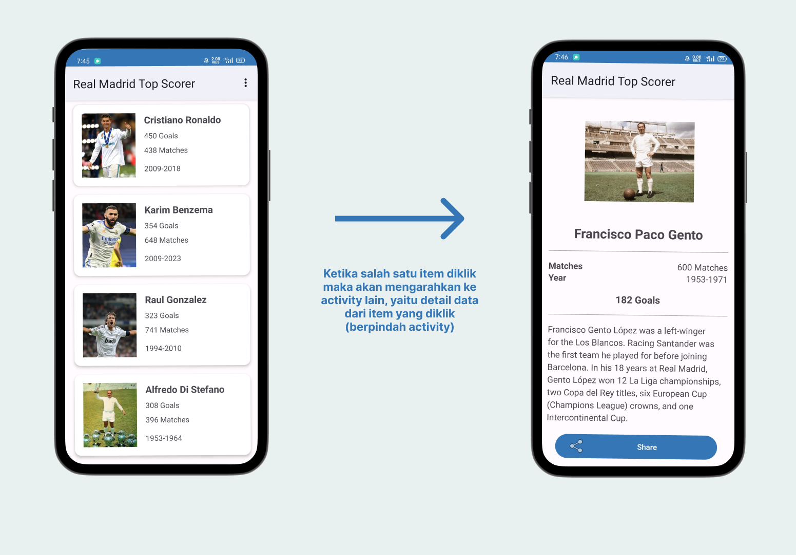
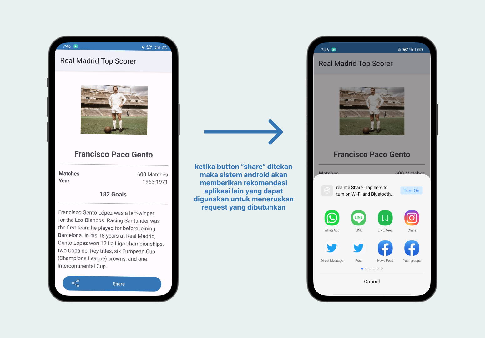

# INTENT

## Pengertian Intent

Intent adalah objek yang digunakan dalam developeran aplikasi Android untuk memfasilitasi komunikasi dan koordinasi antara berbagai komponen aplikasi. Komponen tersebut dapat meliputi Activity, Service, dan Broadcast Receiver. Intent memungkinkan komponen-komponen ini untuk melakukan berbagai tindakan seperti memulai aktivitas (Activity), memulai layanan (Service), atau mengirim dan menerima data antara komponen aplikasi yang berbeda.

## Fungsi Intent
Intent memiliki beberapa kegunaan yaitu sebagai berikut.
1. **Pindah antar Activity**
    
    Penggunaan ini mengacu pada kemampuan untuk mengalihkan pengguna dari satu layar aplikasi ke layar lainnya, yang dikenal sebagai Activity.   Hal ini bisa dilakukan dengan membawa data atau tanpa membawa data. Misalnya, untuk mengalihkan pengguna dari satu Activity ke Activity lain tanpa membawa data, developer dapat menggunakan Intent untuk memulai Activity baru.
2. **Menjalankan Background Service**

    Kegunaan ini mencakup kemampuan untuk menjalankan tugas-tugas di latar belakang, seperti sinkronisasi data ke server atau melakukan proses berulang secara periodik. Misalnya, developer dapat membuat layanan latar belakang untuk melakukan sinkronisasi data ke server, yang berjalan di latar belakang tanpa memerlukan antarmuka pengguna.
3. **Mengirimkan Obyek Broadcast**

    Kegunaan ini memungkinkan aplikasi untuk mengirim pesan atau notifikasi kepada komponen aplikasi lain atau sistem Android. Hal ini berguna untuk memberi tahu aplikasi lain tentang peristiwa tertentu yang terjadi, seperti booting selesai atau koneksi jaringan berubah. Misalnya, developer dapat mengirimkan obyek broadcast untuk memberi tahu aplikasi lain bahwa layanan latar belakang harus dijalankan setelah booting selesai.

## Jenis-jenis Intent

1. **Explicit Intent**

    Explicit Intent digunakan untuk memulai komponen yang sudah dikenal dalam aplikasi saat ini, seperti memulai Activity, Service, atau Broadcast Receiver. Intent ini secara spesifik menyebutkan nama komponen yang akan dipanggil.

    Berikut ini contoh penggunaan dari **Explicit Intent**.
    ```kotlin
    val explicitIntent = Intent(this, SecondActivity::class.java)
    startActivity(explicitIntent)
    ```

    Dalam contoh di atas, **this** mengacu pada *context* dari Activity saat ini. **SecondActivity::class.java** adalah nama kelas dari Activity yang ingin dipanggil. Dengan demikian, aplikasi akan membuka **SecondActivity** tanpa memberikan opsi lainnya.

    Berikut ini contoh penggunaan **Explicit Intent** dengan ilustrasi.

    

2. **Implicit Intent**

    Implicit Intent digunakan untuk memulai komponen yang bisa dilakukan oleh komponen-komponen lain di dalam sistem Android. Intent ini tidak menyebutkan komponen secara spesifik, melainkan hanya aksi yang ingin dilakukan. Sistem Android akan menentukan komponen yang paling sesuai untuk menangani Intent tersebut.

    Berikut ini contoh penggunaan dari **Implicit Intent**.
    ```kotlin
    val implicitIntent = Intent(Intent.ACTION_VIEW, Uri.parse("https://siakad.uns.ac.id"))
    startActivity(implicitIntent)
    ```
    Dalam contoh di atas, Intent.ACTION_VIEW adalah aksi yang ingin dilakukan dalam Implicit Intent, yaitu membuka halaman web dengan URL "https://siakad.uns.ac.id".

    Berikut ini contoh penggunaan **Implicit Intent** dengan ilustrasi.

    


#### Berikut ini adalah referensi untuk memperdalam pemahaman mengenai Intent.
- [Intent](https://developer.android.com/reference/android/content/Intent.html)
- [Intent Filter](https://developer.android.com/guide/components/intents-filters.html)

  [BACK](../../Materi.md) 

