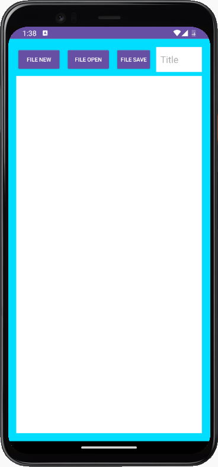
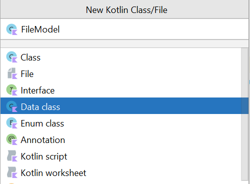
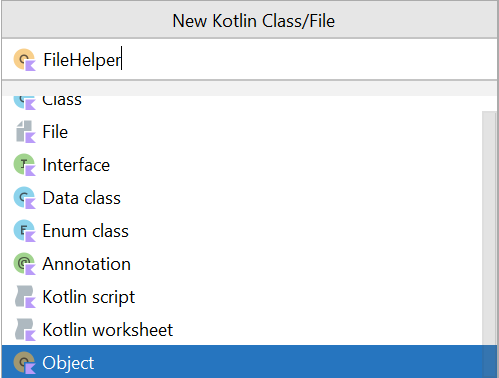

**[{{ Modul Materi (File Storage) }}](1-FileStorage.md)**

# Praktik File Storage

## Alur Praktikum

1. Buat Project Baru dengan Compose
2. Tambahkan Dependencies Dilevel Module
3. Membuat Model Data (FileModel) – Menyimpan informasi file.
4. Membuat FileHelper – Class utilitas untuk operasi baca/tulis file.
5. Menambahkan Theme sendiri
6. Menggunakan ViewModel untuk State Management – Mengelola state aplikasi.
7. Membangun UI dengan Jetpack Compose – Desain tampilan aplikasi.
8. Menjalankan aplikasi.

## 1. Buat Project Baru

| Field                        | Value                |
| ---------------------------- | -------------------- |
| Nama Project                 | MyReadWriteFile      |
| Templates                    | Phone and Tablet     |
| Tipe Activity                | Empty Views Activity (Compose Ver) |
| Language                     | Kotlin               |
| Minimum SDK                  | API level 29         |
| Build Configuration Language | Kotlin DSL           |

## 2. Tambahkan Dependencies Dilevel Module

`build.gradle.kts (Module:App)`

```
dependencies {
    implementation("androidx.activity:activity-compose:1.8.0")
    implementation("androidx.compose.material3:material3:1.1.2")
    implementation("androidx.compose.ui:ui-tooling-preview:1.5.4")
    implementation("androidx.lifecycle:lifecycle-viewmodel-compose:2.6.2")
}
```

Berikut adalah hasil tampilannya:



## 3. Membuat Data Class (FileModel)



```kotlin
data class FileModel(
    var filename: String? = null,
    var data: String? = null
)
```

## 4. Membuat Object (FileHelper)



```kotlin
internal object FileHelper {

    fun writeToFile(fileModel: FileModel, context: Context) {
        context.openFileOutput(fileModel.filename, Context.MODE_PRIVATE).use {
            it.write(fileModel.data?.toByteArray())
        }
    }
    fun readFromFile(context: Context, filename: String): FileModel {
        val fileModel = FileModel()
        fileModel.filename = filename
        fileModel.data = context.openFileInput(filename).bufferedReader().useLines { lines ->
            lines.fold("") { some, text ->
                 "$some$text\n"
            }
        }
        return fileModel
    }
}
```

## 5. Implementasi di Activity

Tambahkan `View Binding` pada `build.gradle.kts (app)` terlebih dahulu lalu `sync`.

```gradle
android {
    ...

    buildFeatures {
        viewBinding = true
    }
}
```

---

```kotlin
class MainActivity : AppCompatActivity(), View.OnClickListener {

    private lateinit var binding: ActivityMainBinding

    override fun onCreate(savedInstanceState: Bundle?) {
        super.onCreate(savedInstanceState)
        binding = ActivityMainBinding.inflate(layoutInflater)
        setContentView(binding.root)

        binding.buttonNew.setOnClickListener(this)
        binding.buttonOpen.setOnClickListener(this)
        binding.buttonSave.setOnClickListener(this)

    }

    override fun onClick(view: View) {
        when (view.id) {
            R.id.button_new -> newFile()
            R.id.button_open -> showList()
            R.id.button_save -> saveFile()
        }
    }

    private fun newFile() {
        binding.editTitle.setText("")
        binding.editFile.setText("")
        Toast.makeText(this, "Clearing file", Toast.LENGTH_SHORT).show()
    }

    private fun showList() {
        val items = fileList()
        val builder = AlertDialog.Builder(this)
        builder.setTitle("Pilih file yang diinginkan")
        builder.setItems(items) { dialog, item -> loadData(items[item].toString()) }
        val alert = builder.create()
        alert.show()
    }

    private fun loadData(title: String) {
        val fileModel = FileHelper.readFromFile(this, title)
        binding.editTitle.setText(fileModel.filename)
        binding.editFile.setText(fileModel.data)
        Toast.makeText(this, "Loading " + fileModel.filename + " data", Toast.LENGTH_SHORT).show()
    }

    private fun saveFile() {
        when {
            binding.editTitle.text.toString().isEmpty() -> Toast.makeText(this, "Title harus diisi terlebih dahulu", Toast.LENGTH_SHORT).show()
            binding.editFile.text.toString().isEmpty() -> Toast.makeText(this, "Kontent harus diisi terlebih dahulu", Toast.LENGTH_SHORT).show()
            else -> {
                val title = binding.editTitle.text.toString()
                val text = binding.editFile.text.toString()
                val fileModel = FileModel()
                fileModel.filename = title
                fileModel.data = text
                FileHelper.writeToFile(fileModel, this)
                Toast.makeText(this, "Saving " + fileModel.filename + " file", Toast.LENGTH_SHORT).show()
            }
        }
    }
}
```

## Referensi Tambahan

[Nikoloz Akhvlediani - Scoped Storage, SAF & MediaStore](https://www.youtube.com/watch?v=8Qs8jCOgEyI)

**[{{ Modul Materi (File Storage) }}](1-FileStorage.md)**
