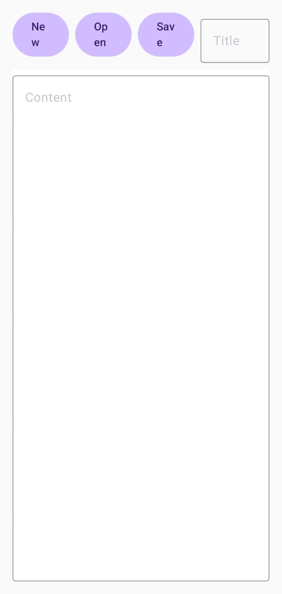

**[{{ Modul Materi (File Storage) }}](1-FileStorage.md)**

# Praktik File Storage

## Alur Praktikum

1. Buat Project Baru dengan Compose
2. Tambahkan Dependencies Dilevel Module
3. Membuat Model Data (FileModel) – Menyimpan informasi file.
4. Membuat FileHelper – Class utilitas untuk operasi baca/tulis file.
5. Menambahkan Theme sendiri
6. Menggunakan ViewModel untuk State Management – Mengelola state aplikasi.
7. Membangun UI dengan Jetpack Compose – Desain tampilan aplikasi.
8. Menjalankan aplikasi.

## 1. Buat Project Baru

| Field                        | Value                |
| ---------------------------- | -------------------- |
| Nama Project                 | MyReadWriteFile      |
| Templates                    | Phone and Tablet     |
| Tipe Activity                | Empty Views Activity (Compose Ver) |
| Language                     | Kotlin               |
| Minimum SDK                  | API level 29         |
| Build Configuration Language | Kotlin DSL           |

## 2. Tambahkan Dependencies Dilevel Module

`build.gradle.kts (Module:App)`

```
dependencies {
    implementation("androidx.core:core-ktx:1.12.0")
    implementation("androidx.activity:activity-compose:1.8.0")
    implementation("androidx.compose.material3:material3:1.1.2")
}
```

## 3. Membuat Model Data (FileModel) – Menyimpan informasi file.
`FileModel.kt`
```kotlin
data class FileModel(
    var filename: String? = null,
    var data: String? = null
)
```

## 4. Membuat FileHelper – Class utilitas untuk operasi baca/tulis file.
`FileHelper.kt`
```kotlin
internal object FileHelper {
    fun writeToFile(fileModel: FileModel, context: Context) {
        context.openFileOutput(fileModel.filename, Context.MODE_PRIVATE).use {
            it.write(fileModel.data?.toByteArray())
        }
    }

    fun readFromFile(context: Context, filename: String): FileModel {
        val fileModel = FileModel()
        fileModel.filename = filename
        fileModel.data = context.openFileInput(filename).bufferedReader().useLines { lines ->
            lines.fold("") { some, text -> "$some$text\n" }
        }
        return fileModel
    }
}
```

## 5. Menambahkan Theme sendiri
`MyReadAndWriteTheme.kt`
```kotlin
private val DarkColorScheme = darkColorScheme(
    primary = Purple80,
    secondary = PurpleGrey80,
    tertiary = Pink80
)

private val LightColorScheme = lightColorScheme(
    primary = Purple40,
    secondary = PurpleGrey40,
    tertiary = Pink40
)

@Composable
fun MyReadWriteFileTheme(
    darkTheme: Boolean = isSystemInDarkTheme(),
    content: @Composable () -> Unit
) {
    val colorScheme = if (darkTheme) DarkColorScheme else LightColorScheme

    MaterialTheme(
        colorScheme = colorScheme,
        typography = Typography,
        content = content
    )
}
```


## 6. Membangun UI dengan Jetpack Compose – Desain tampilan aplikasi.
`MainActivity.kt`
```kotlin
class MainActivity : ComponentActivity() {
    override fun onCreate(savedInstanceState: Bundle?) {
        super.onCreate(savedInstanceState)
        setContent {
            MyReadWriteFileTheme {
                FileStorageScreen()
            }
        }
    }
}

@Composable
fun FileStorageScreen() {
    // State Management
    var title by rememberSaveable { mutableStateOf("") }
    var content by rememberSaveable { mutableStateOf("") }
    var showFileDialog by rememberSaveable { mutableStateOf(false) }
    var availableFiles by rememberSaveable { mutableStateOf(emptyArray<String>()) }

    val context = LocalContext.current

    // Handler Functions
    fun newFile() {
        title = ""
        content = ""
    }

    fun loadFileList() {
        availableFiles = context.fileList()
        showFileDialog = true
    }

    fun saveFile() {
        if (title.isNotEmpty() && content.isNotEmpty()) {
            FileHelper.writeToFile(FileModel(title, content), context)
        }
    }

    fun loadFile(filename: String) {
        val fileModel = FileHelper.readFromFile(context, filename)
        title = fileModel.filename ?: ""
        content = fileModel.data ?: ""
    }

    Column(
        modifier = Modifier
            .fillMaxSize()
            .padding(16.dp)
    ) {
        // Header with buttons
        Row(
            modifier = Modifier.fillMaxWidth(),
            horizontalArrangement = Arrangement.spacedBy(8.dp)
        ) {
            Button(
                onClick = { newFile() },
                modifier = Modifier.width(72.dp)
            ) {
                Text("New")
            }
            Button(
                onClick = { loadFileList() },
                modifier = Modifier.width(72.dp)
            ) {
                Text("Open")
            }
            Button(
                onClick = { saveFile() },
                modifier = Modifier.width(72.dp)
            ) {
                Text("Save")
            }
            OutlinedTextField(
                value = title,
                onValueChange = { title = it },
                label = { Text("Title") },
                modifier = Modifier.weight(1f)
            )
        }

        Spacer(modifier = Modifier.height(8.dp))

        // Content editor
        OutlinedTextField(
            value = content,
            onValueChange = { content = it },
            label = { Text("Content") },
            modifier = Modifier
                .fillMaxSize()
                .background(Color.White),
            textStyle = LocalTextStyle.current.copy(
                textAlign = TextAlign.Start
            ),
            singleLine = false
        )
    }

    // File selection dialog
    if (showFileDialog) {
        AlertDialog(
            onDismissRequest = { showFileDialog = false },
            title = { Text("Pilih file") },
            text = {
                Column {
                    availableFiles.forEach { filename ->
                        TextButton(
                            onClick = {
                                loadFile(filename)
                                showFileDialog = false
                            }
                        ) {
                            Text(filename)
                        }
                    }
                }
            },
            confirmButton = {
                TextButton(
                    onClick = { showFileDialog = false }
                ) {
                    Text("Cancel")
                }
            }
        )
    }
}

@Preview(showBackground = true)
@Composable
fun PreviewFileStorageScreen() {
    MyReadWriteFileTheme {
        FileStorageScreen()
    }
}
```
Berikut adalah hasil tampilannya:



## Referensi Tambahan

[Nikoloz Akhvlediani - Scoped Storage, SAF & MediaStore](https://www.youtube.com/watch?v=8Qs8jCOgEyI)

**[{{ Modul Materi (File Storage) }}](1-FileStorage.md)**
