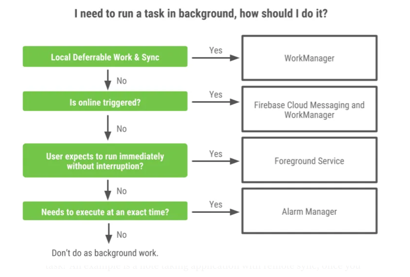

# Work Manager

Pekerjaan akan bersifat persisten jika tetap dijadwalkan melalui proses mulai ulang aplikasi dan sistem memulai ulang komputer. WorkManager adalah solusi yang direkomendasikan untuk pekerjaan persisten. Karena sebagian besar pemrosesan latar belakang paling baik dilakukan melalui kerja persisten, Oleh karena itu, WorkManager juga merupakan API utama yang direkomendasikan untuk latar belakang diproses secara umum.

### Apa itu Work Manager ?
WorkManager adalah pustaka (library) Android yang menjalankan pekerjaan latar belakang yang dapat ditunda ketika kondisi atau batasan (constraints) pekerjaan tersebut telah terpenuhi.
WorkManager ditujukan untuk tugas-tugas yang memerlukan jaminan akan dijalankan oleh sistem, bahkan jika aplikasi telah keluar atau ditutup.
Dengan kata lain, WorkManager menyediakan API yang hemat baterai yang merangkum evolusi panjang pembatasan perilaku tugas latar belakang di Android. Ini sangat penting bagi aplikasi Android yang perlu menjalankan tugas di latar belakang secara andal.

### Kapan Menggunakan Work Manager ?
WorkManager digunakan untuk menangani pekerjaan latar belakang yang perlu dijalankan ketika berbagai kondisi telah terpenuhi, terlepas dari apakah proses aplikasi sedang berjalan atau tidak. Pekerjaan latar belakang dapat dimulai saat aplikasi berada di latar belakang, saat aplikasi sedang dibuka (foreground), atau saat aplikasi awalnya di foreground lalu berpindah ke background. Apapun status aplikasi, pekerjaan latar belakang tersebut harus tetap berjalan, atau dijalankan ulang jika proses aplikasi dihentikan oleh Android.

Salah satu kesalahpahaman umum tentang WorkManager adalah bahwa ia digunakan untuk tugas yang cukup dijalankan di “thread latar belakang” namun tidak perlu bertahan saat proses mati. Ini tidak benar. Untuk kasus seperti itu, ada solusi lain yang lebih tepat, seperti coroutines di Kotlin, ThreadPool, atau pustaka seperti RxJava. Kamu bisa menemukan lebih banyak informasi tentang kasus ini di panduan pemrosesan latar belakang Android.

Ada banyak situasi berbeda di mana kamu perlu menjalankan pekerjaan latar belakang, dan oleh karena itu juga ada solusi berbeda. WorkManager cocok digunakan saat pekerjaan latar belakangmu harus dijalankan secara andal meskipun proses aplikasi dihentikan atau perangkat di-restart.

Berikut gambar diagram yang menunjukkan kapan sebaiknya menggunakan WorkManager:


Dalam kasus penggunaan WorkManager, ia paling cocok digunakan untuk pekerjaan latar belakang yang harus diselesaikan dan dapat ditunda (deferrable).

Bisa kita rujuk pada beberapa pertanyaan berikut :

#### Apakah tugas ini harus diselesaikan?
Contohnya adalah aplikasi pencatat (note-taking) yang melakukan sinkronisasi dengan server jarak jauh. Setelah kamu selesai menulis catatan, kamu tentu mengharapkan aplikasi akan menyinkronkan catatan tersebut dengan server backend. Ini harus tetap terjadi meskipun kamu beralih ke aplikasi lain, atau sistem operasi menutup aplikasi untuk menghemat memori. Sinkronisasi itu juga harus tetap berjalan meskipun perangkat di-restart. Nah, WorkManager menjamin bahwa tugas seperti ini akan diselesaikan.

#### Apakah tugas ini bisa ditunda?
Kalau tugasnya masih bisa berguna meski dijalankan nanti, berarti ia deferrable. Mengacu pada contoh sebelumnya, akan lebih baik jika catatan disinkronkan langsung, tetapi kalau hal itu tidak memungkinkan dan sinkronisasi terjadi beberapa saat kemudian, itu bukan masalah besar. WorkManager menghormati batasan-batasan sistem operasi terkait pekerjaan latar belakang, dan akan mencoba menjalankan tugasmu dengan cara yang hemat baterai.

### Mengapa Menggunakan WorkManager?
WorkManager menjalankan pekerjaan latar belakang sambil menangani berbagai masalah kompatibilitas serta mengikuti praktik terbaik terkait konsumsi baterai dan kesehatan sistem — semuanya untukmu.

Selain itu, dengan WorkManager kamu bisa menjadwalkan:
- Tugas periodik, dan
- Rangkaian tugas yang kompleks dan saling bergantung.

Pekerjaan latar belakang bisa dieksekusi secara paralel maupun berurutan, di mana kamu dapat menentukan urutan eksekusinya. WorkManager secara otomatis menangani pengiriman input dan output antar tugas.


### Jenis pekerjaan persisten
WorkManager menangani tiga jenis pekerjaan persisten:

- Langsung: Tugas yang harus segera dimulai dan diselesaikan. Mungkin diprioritaskan.
- Berjalan Lama: Tugas yang mungkin berjalan lebih lama, kemungkinan lebih lama dari 10 menit.
- Dapat ditangguhkan: Tugas terjadwal yang dimulai di lain waktu dan dapat dijalankan secara berkala.

Gambar ini menguraikan bagaimana berbagai jenis pekerjaan persisten terkait satu sama lain.


Demikian pula, tabel berikut menguraikan berbagai jenis pekerjaan.

| Jenis | Periodisitas | Cara mengakses |
| -- | -- | -- |
| Segera | Satu kali | OneTimeWorkRequest dan Worker. Untuk pekerjaan yang diprioritaskan, panggil setExpedited() di OneTimeWorkRequest. |
| Berjalan Lama | Satu kali atau berkala | WorkRequest apa pun atau Worker. Panggil setForeground() di Pekerja untuk menangani notifikasi. |
| Dapat ditangguhkan | Satu kali atau berkala | PeriodicWorkRequest dan Worker. |

```kotlin
val continuation = WorkManager.getInstance(context)
    .beginUniqueWork(
        Constants.IMAGE_MANIPULATION_WORK_NAME,
        ExistingWorkPolicy.REPLACE,
        OneTimeWorkRequest.from(CleanupWorker::class.java)
    ).then(OneTimeWorkRequest.from(WaterColorFilterWorker::class.java))
    .then(OneTimeWorkRequest.from(GrayScaleFilterWorker::class.java))
    .then(OneTimeWorkRequest.from(BlurEffectFilterWorker::class.java))
    .then(
        if (save) {
            workRequest<SaveImageToGalleryWorker>(tag = Constants.TAG_OUTPUT)
        } else /* upload */ {
            workRequest<UploadWorker>(tag = Constants.TAG_OUTPUT)
        }
    )

```

Untuk setiap tugas kerja, Anda dapat menentukan data input dan output untuk tugas tersebut. Saat merantai pekerjaan bersama, WorkManager secara otomatis meneruskan data output dari satu tugas kerja ke tugas berikutnya.

#### Interoperabilitas threading bawaan
WorkManager terintegrasi dengan lancar dengan Coroutine dan RxJava dan memberikan fleksibilitas untuk melakukan plugin API asinkron Anda sendiri.

### Menggunakan WorkManager untuk pekerjaan yang andal
WorkManager dimaksudkan untuk pekerjaan yang perlu berjalan secara andal meskipun pengguna mematikan layar, aplikasi keluar, atau perangkat dimulai ulang. Contoh:

Mengirim log atau analisis ke layanan backend.
Menyinkronkan data aplikasi dengan server secara berkala.
WorkManager tidak dimaksudkan untuk pekerjaan latar belakang dalam proses yang dapat dihentikan dengan aman jika proses aplikasi berhenti. Solusi ini juga bukan solusi umum untuk semua pekerjaan yang memerlukan eksekusi langsung. Tinjau panduan pemrosesan di latar belakang untuk menemukan solusi mana yang sesuai dengan kebutuhan Anda.

### Hubungan dengan API lainnya
Meskipun coroutine adalah solusi yang direkomendasikan untuk kasus penggunaan tertentu, Anda tidak boleh menggunakannya untuk pekerjaan persisten. Penting untuk diperhatikan bahwa coroutine adalah framework konkurensi, sedangkan WorkManager adalah library untuk Anda. Anda juga harus menggunakan AlarmManager untuk jam atau kalender saja.

| API | Direkomendasikan untuk | Hubungan dengan WorkManager |
| -- | -- | -- |
| Coroutine | Semua pekerjaan asinkron yang tidak harus persisten. | Coroutine adalah cara standar untuk keluar dari thread utama di Kotlin. Namun, coroutine akan meninggalkan memori setelah aplikasi ditutup. Untuk pekerjaan persisten, gunakan WorkManager. |
| AlarmManager | Hanya alarm. | Tidak seperti WorkManager, AlarmManager mengaktifkan perangkat dari mode Istirahatkan. Oleh karena itu, ini tidak efisien dalam hal pengelolaan daya dan resource. Hanya gunakan untuk alarm atau notifikasi akurat seperti acara kalender — bukan pekerjaan latar belakang. |

### Mengganti API yang tidak digunakan lagi
WorkManager API adalah pengganti yang direkomendasikan untuk semua Android versi sebelumnya API penjadwalan latar belakang, termasuk FirebaseJobDispatcher, GcmNetworkManager, dan JobScheduler.
